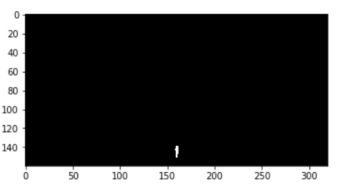
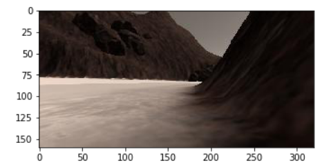
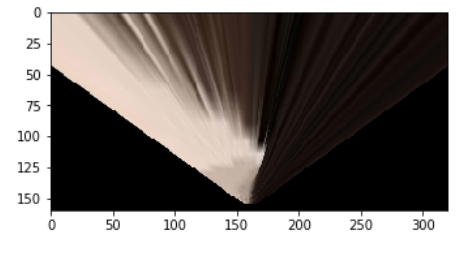
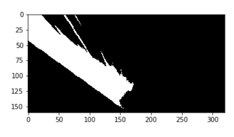
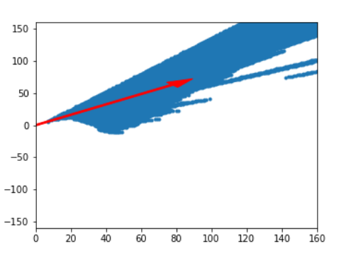
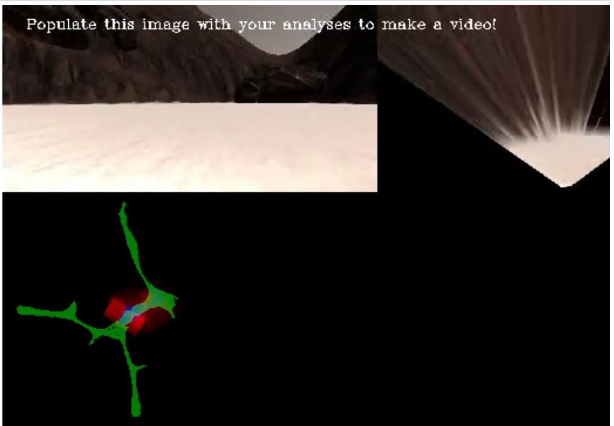
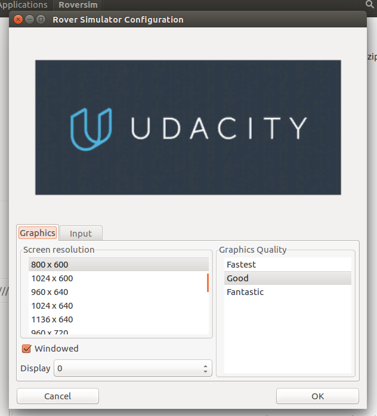
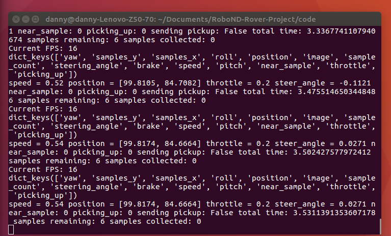
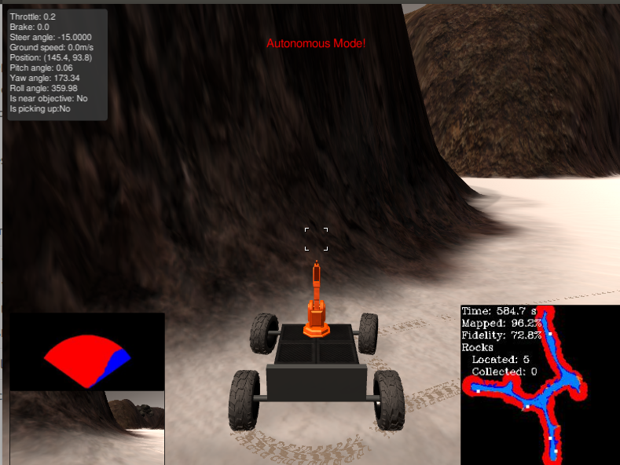
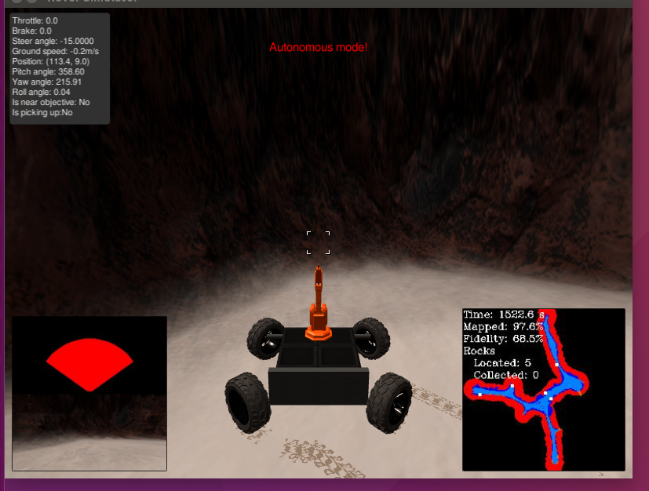

## Project: Search and Sample Return
### Writeup Template: You can use this file as a template for your writeup if you want to submit it as a markdown file, but feel free to use some other method and submit a pdf if you prefer.

## Rubric Points

### Notebook analysis
#### Rubric 1
   Run the functions provided in the notebook on test images (first with the 
   test data provided, next on data you have recorded). 
   Add/modify functions to allow for color selection of obstacles and rock 
   samples. 

   Describe in your writeup (and identify where in your code) how you modified
   or added functions to add obstacle and rock sample identification. 

   - Both obstacle detection and rock sample detection were implemented in 
     process_image().
   - Obstacle detection was implemented by applying np.logical_not to the 
     navigable terrain img which reduced the need for an almost duplicate
     function.
   - Rock sample identification occurs in rock_color_range_hsv(). It uses an 
     OpenCV command to convert the RGB image to HSV with a range of values which
     a rock contains. This was then used to identify the rock by converting 
     these coordinates to 1's in the output image (Image 1)

#### Image 1- Identified rock in image

#### Rubric 2
   Populate the process_image() function with the appropriate analysis steps 
   to map pixels identifying navigable terrain, obstacles and rock samples into
   a worldmap. Run process_image() on your test data using the moviepy functions
   provided to create video output of your result. 

   Describe in your writeup how you modified the process_image() to demonstrate 
   your analysis and how you created a worldmap. Include your video output with
   your submission.

   - The process_image() function completes the following steps:
      - Applies the perspective_transform() function which converts the rover   
        input camera images (Image 2) into a birds-eye view of the image
        (Image 3). 

#### Image 2- Camera image from rover

#### Image 3- Birds-eye view of camera image through perspective_transform()

   - Next the rover-centered images of navigable terrain, rocks and obstacles
     are produced in stage 3) and 4). Image 4 and 5 show these stages 
     respectively

#### Image 4- Color-thresholded image displayed as black and white image 

#### Image 5- Rover-centered coordinates outputted by rover_coords()

   - These coordinates are then converted to world coordinates (relative to 
     the starting position of the rover) in stage 5).

   - Then finally the worldmap that is stored in the data instance of 
     Databucket() is updated in stage 6) which is then outputted to generate
     the video test_mappig.mp4 located in the output folder of the project
     directory. A snapshot of the final video is found in Image 6

#### Image 6- Screenshot of the outputted video of Rover_Project_Test_Notebook

### Autonomous Navigation and Mapping

#### Rubric 3
   Fill in the perception_step() (at the bottom of the perception.py script) 
   and decision_step() (in decision.py) functions in the autonomous mapping 
   scripts and an explanation is provided in the writeup of how and why these 
   functions were modified as they were.

   perception_step() and decision_step() functions have been filled in and 
   their functionality explained in the writeup. 

   - The perception_step() explained:
      - In addition to the process_image() functionality that was implemented,
        there were some key optmisations that are noted here.
      - Firstly in perspective_transform() a single line was added:

        'mask = cv2.warpPerspective(np.ones_like(img[:,:,0]), M, (img.shape[1], img.shape[0]))'

        which removes data points from the obstable map to improve mapping 
        accuracy.
 
      - Similarly the function 'apply_ellipse_mask()' outputs another elliptical
        mask to both the navigable map and rock map in stage 3). This also has
        the effect of increasing the quality of mapping and navigation. 

      - In order to improve the fidelity of mapping, a condition in stage 7)
        is to only update the rover' worldmap when the rover is grounded and
        level (by imposing conditionds for pitch and roll).
     

   - The 'decision_step()' explained:
      - The first implemented condition is updating the rover's status on the 
        condition that steering inputs where received.

      - When going forward, the rover would determine whether there were more
        navigable pixels than the stop_forward limit. If there were, the rover
        would continue to steer in the direction of the average navigable
        terrain.
      
      - If the Rover.mode was stop, the rover would ensure it was actually
        still, before turning on the spot until there were enough navigable 
        terrain in front of it. Once this occurred, the state would change to
        forward before exiting the end of the cycle.

#### Rubric 4
   Launching in autonomous mode your rover can navigate and map autonomously. 
   Explain your results and how you might improve them in your writeup.

   By running drive_rover.pyand launching the simulator in autonomous mode, 
   your rover does a reasonably good job at mapping the environment.

   The rover must map at least 40% of the environment with 60% fidelity 
   (accuracy) against the ground truth. You must also find (map) the location 
   of at least one rock sample. They don't need to pick any rocks up, just 
   have them appear in the map (should happen automatically if their map pixels
   in Rover.worldmap[:,:,1] overlap with sample locations.)

   - The conditions for the autonomous simluation runs were
      - A resolution of 800x600p, (Image 7) 
      - Good graphics quality, (Image 7)
      - and FPS output is ~15 fps. (Image 8)

#### Image 7- Resolution and graphics setup

#### Image 8- FPS output

   - The fidelity of the ground truth is normally 65-75% for an 80% map 
     completion. On these autonomous navigation runs, the rover normally maps
     around 5 rock samples within this time. (Images 9 & 10)

#### Image 9-Finished mapping example 1

#### Image 10-Finished mapping example 2

##### Critiques and improvements of the code

   - Critique 1- Rover sometimes gets stuck on the smaller rocks

   - Suggested improvements: 
      - Remove the influence of pixels greater than 0.5m from the rover; this
        would increase the sensitivity of the steering to the obstacles 
        immediately in front of the rover

   - Critique 2- The rover maps the same areas twice

   - Suggested improvements:
      - Use left-hand crawling/bias to improve decision making
      - Add a channel to the world-map that informs the rover the map is filled
        in

   - Critique 3- Rover does not map small paths in world.
      - Same improvements as critique 1
      - Introduce a stop, rotate on the spot mapping function when given two 
        different route options

